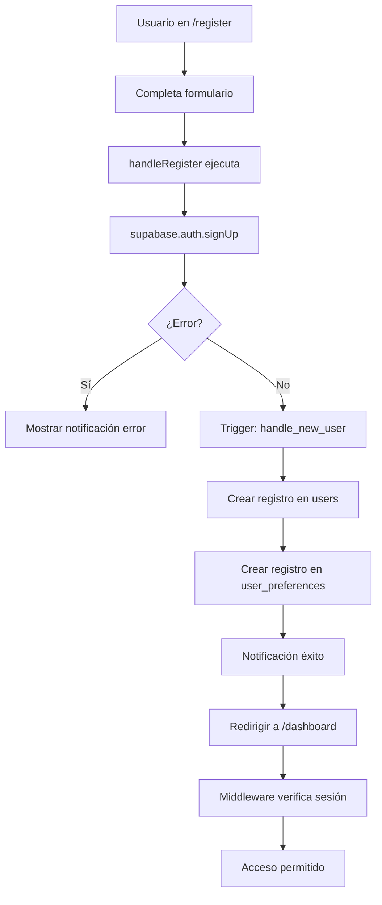

# Prueba de Autenticación con Supabase

## ✅ Cambios Implementados

### 1. Página de Login (`src/app/(auth)/login/page.tsx`)
- ✅ Importado `createClient` de Supabase
- ✅ Agregados estados para `email` y `password`
- ✅ Implementada función `handleLogin` con `supabase.auth.signInWithPassword()`
- ✅ Manejo de errores con notificaciones
- ✅ Inputs controlados con state

### 2. Página de Registro (`src/app/(auth)/register/page.tsx`)
- ✅ Importado `createClient` de Supabase
- ✅ Agregados estados para `fullName`, `email`, `password`, `confirmPassword`
- ✅ Implementada función `handleRegister` con `supabase.auth.signUp()`
- ✅ Validación de contraseñas coincidentes
- ✅ Validación de aceptación de términos
- ✅ Manejo de errores con notificaciones
- ✅ Inputs controlados con state

### 3. Middleware (`src/middleware.ts`)
- ✅ Eliminado bypass mock (`sb-mock-token`)
- ✅ Eliminada variable `activeUser`
- ✅ Uso exclusivo de `user` de Supabase Auth
- ✅ Protección de rutas funcionando con autenticación real

---

## 🧪 Cómo Probar

### Paso 1: Registrar un Nuevo Usuario

1. Navega a `http://localhost:3000/register`
2. Completa el formulario:
   - **Nombre Completo**: Tu nombre
   - **Email**: tu-email@ejemplo.com
   - **Contraseña**: mínimo 6 caracteres
   - **Repetir Contraseña**: la misma contraseña
3. Acepta los términos y condiciones
4. Haz clic en "Crear cuenta"

**Resultado Esperado:**
- ✅ Notificación de éxito: "¡Cuenta Creada! Bienvenido a TimeTrack Pro."
- ✅ Redirección automática a `/dashboard`
- ✅ Usuario creado en Supabase Auth
- ✅ Registro automático en tabla `users` (por trigger)
- ✅ Registro automático en tabla `user_preferences` (por trigger)

### Paso 2: Verificar en Supabase Dashboard

1. Ve a https://supabase.com/dashboard/project/kmovzonhrxxthvwnaukk
2. Navega a **Authentication > Users**
3. Deberías ver tu usuario recién creado

4. Navega a **Table Editor > users**
5. Deberías ver un registro con tu email y nombre

6. Navega a **Table Editor > user_preferences**
7. Deberías ver las preferencias por defecto para tu usuario

### Paso 3: Cerrar Sesión

Para cerrar sesión, abre la consola del navegador y ejecuta:

```javascript
const { createClient } = await import('./src/lib/supabase/client.ts')
const supabase = createClient()
await supabase.auth.signOut()
location.reload()
```

O simplemente borra las cookies de Supabase en DevTools.

**Resultado Esperado:**
- ✅ Redirección automática a `/login` (por middleware)

### Paso 4: Iniciar Sesión

1. Navega a `http://localhost:3000/login`
2. Ingresa:
   - **Email**: el email que registraste
   - **Contraseña**: la contraseña que usaste
3. Haz clic en "Entrar"

**Resultado Esperado:**
- ✅ Notificación de éxito: "¡Bienvenido! Has iniciado sesión correctamente."
- ✅ Redirección automática a `/dashboard`
- ✅ Sesión activa en Supabase

### Paso 5: Probar Protección de Rutas

**Con sesión activa:**
- ✅ Puedes acceder a `/dashboard`, `/history`, `/calendar`, etc.
- ✅ Si intentas ir a `/login` o `/register`, te redirige a `/dashboard`

**Sin sesión activa:**
- ✅ Si intentas acceder a `/dashboard`, te redirige a `/login`
- ✅ Puedes acceder libremente a `/login` y `/register`

---

## 🔍 Verificar Datos en Supabase

### Consulta SQL para ver usuarios

```sql
SELECT 
    u.id,
    u.email,
    u.full_name,
    u.created_at,
    up.theme,
    up.language
FROM users u
LEFT JOIN user_preferences up ON u.id = up.user_id
ORDER BY u.created_at DESC;
```

### Verificar que el trigger funcionó

Después de registrar un usuario, ejecuta:

```sql
-- Ver usuario en tabla users
SELECT * FROM users WHERE email = 'tu-email@ejemplo.com';

-- Ver preferencias creadas automáticamente
SELECT * FROM user_preferences WHERE user_id = (
    SELECT id FROM users WHERE email = 'tu-email@ejemplo.com'
);
```

---

## ⚠️ Posibles Errores y Soluciones

### Error: "Invalid login credentials"
**Causa**: Email o contraseña incorrectos
**Solución**: Verifica que estés usando las credenciales correctas

### Error: "User already registered"
**Causa**: El email ya está registrado
**Solución**: Usa otro email o inicia sesión con el existente

### Error: "Password should be at least 6 characters"
**Causa**: Contraseña muy corta
**Solución**: Usa una contraseña de al menos 6 caracteres

### Error: "Las contraseñas no coinciden"
**Causa**: Los campos de contraseña y repetir contraseña son diferentes
**Solución**: Asegúrate de escribir la misma contraseña en ambos campos

### No se crea el usuario en las tablas
**Causa**: El trigger `handle_new_user` no está funcionando
**Solución**: Verifica que la migración `003_functions_triggers.sql` se aplicó correctamente

---

## 📊 Flujo Completo de Autenticación



---

## ✨ Próximos Pasos

Una vez verificado que la autenticación funciona:

1. **Actualizar Dashboard** para mostrar datos del usuario autenticado
2. **Implementar Logout** en el menú de usuario
3. **Actualizar Servicios** para usar datos reales de Supabase
4. **Probar CRUD** de sesiones de trabajo
5. **Implementar Recuperación de Contraseña**

---

## 🎯 Checklist de Verificación

- [ ] Puedo registrar un nuevo usuario
- [ ] El usuario aparece en Supabase Auth
- [ ] El usuario aparece en tabla `users`
- [ ] Las preferencias aparecen en tabla `user_preferences`
- [ ] Puedo iniciar sesión con el usuario creado
- [ ] No puedo acceder a `/dashboard` sin sesión
- [ ] Soy redirigido a `/dashboard` si intento ir a `/login` con sesión activa
- [ ] Los errores se muestran correctamente (contraseñas no coinciden, etc.)
